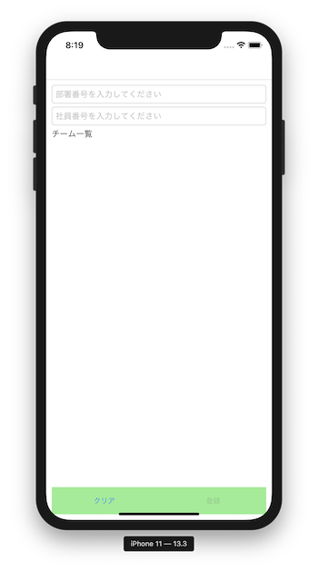
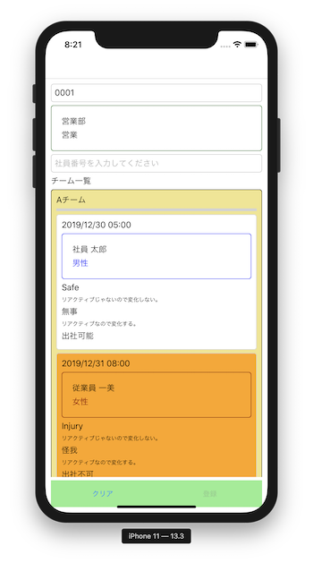
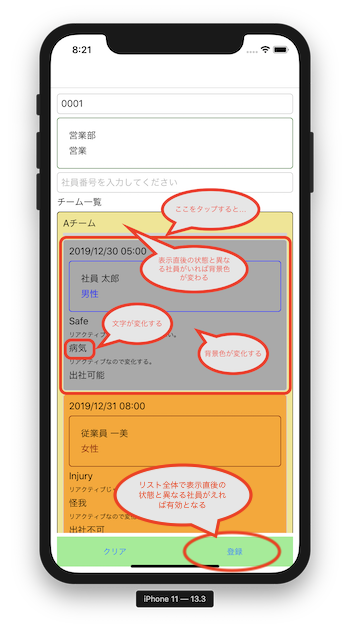
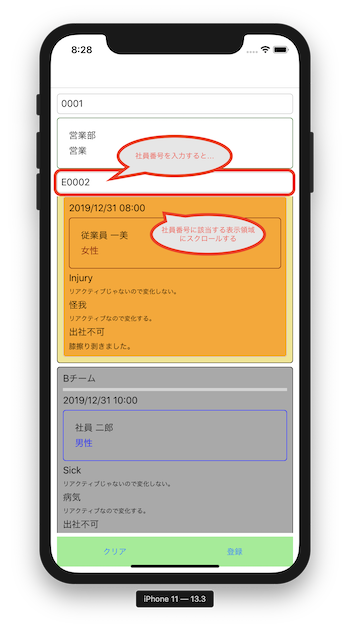
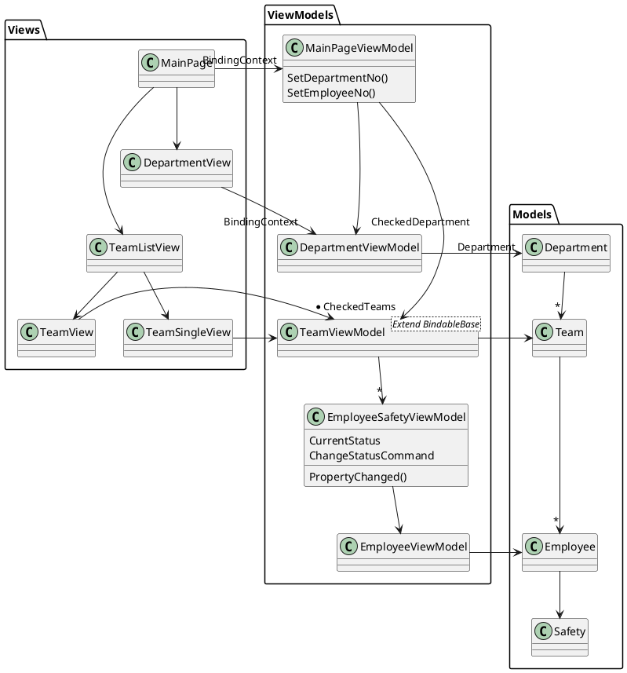

# BindingSampleの説明

1. 初期状態



2. 読取状態



3. 登録可能状態



4. 社員番号入力によるスクロール



## クラス構成


## MVVM

http://blog.pionet.co.jp/experience/archives/2143

* View：ユーザインターフェイス(UI)。
* Model：業務ロジック、業務データ。
* ViewModel：ViewとModelを繋ぐ。

最低限のルールとして、View → ViewModel → Modelの参照方向を守る。

Modelに影響しない画面制御はViewのコードビハインドのみで実装する。

業務データの定義、業務データの管理はModelが行う。

UI操作による業務データの制御はViewModelが行う。<br>
ボタンタップによるデータの取得・登録など。

## View操作による処理の実行

ViewからViewModelを呼び出し、ViewModelで画面の入力値・状態およびModelの状態に合わせて処理を行う。

### ViewからViewModelの呼び出し方① コマンド

**MainView.xml**
```XML
<Button
    Grid.Row="0"
    Grid.Column="1"
    Command="{Binding RegisterCommand}"
    Text="登録"/>
```

**MainPageViewModel.cs**
```cs
public class MainPageViewModel
{
    /// <summary>
    /// 登録コマンド。
    /// </summary>
    public ICommand RegisterCommand { get; private set; }

    /// <summary>
    /// コンストラクタ
    /// </summary>
    /// <param name="dialogService"></param>
    public MainPageViewModel(IPageDialogService dialogService)
    {
        // 登録コマンドの実装。
        RegisterCommand = new Command(
            execute: async () =>
            {
                // 登録コマンドでは、ダイアログを表示する。
                await dialogService.DisplayAlertAsync("たいとる", "きた", "OK");
            },
            canExecute: () =>
            {
                // 登録コマンドが実行可能な条件。
                return IsRegistable();
            });
    }
}
```

Command属性がないViewにタップコマンドを実装する場合は、TapGestureRecognizerでCommandを実装する。

**TeamView.xml**
```xml
<Frame
    BorderColor="LightGray"
    BackgroundColor="{Binding BackgroundColor.Value}"
    HasShadow="False"
    Padding="10,10,10,10">

    <Frame.GestureRecognizers>
        <TapGestureRecognizer
            Command="{Binding ChangeStatusCommand}" />
    </Frame.GestureRecognizers>
```

**EmployeeSafetyViewModel.cs**
```C#
public class EmployeeSafetyViewModel : INotifyPropertyChanged
{
    /// <summary>
    /// 安否状態変更コマンド
    /// </summary>
    public ReactiveCommand ChangeStatusCommand { get; set; } = new ReactiveCommand();

    /// <summary>
    /// コンストラクタ
    /// </summary>
    /// <param name="emp"></param>
    public EmployeeSafetyViewModel(Employee emp)
    {
        // 安否状態変更コマンドの処理定義。
        ChangeStatusCommand.Subscribe(x => OnChangeStatusCommand());
    }

    /// <summary>
    /// 安否状態変更コマンド処理。
    /// </summary>
    private void OnChangeStatusCommand()
    {
        // (コマンド処理)
    }
}
```

### ViewからViewModelの呼び出し方②　コードビハインドに実装したイベントハンドラからViewModelを呼び出す

コマンドを実装しにくいイベントからViewModelを呼び出す場合に利用する。<br>
各種Viewが持つイベントハンドラや役割はMicrosoftのAPIドキュメントに説明がある。

**MainPage.xaml**
```xml
<Entry
    Placeholder="部署番号を入力してください"
    MaxLength="{StaticResource DEPARTMENT_NO_LENGTH}"
    TextChanged="OnDepartmentNoTextChanged" />
```

**MainPage.xaml.cs**
```C#
public partial class MainPage : ContentPage
{
    /// <summary>
    /// 本ViewのViewModel。
    /// </summary>
    private MainPageViewModel ViewModel { get => this.BindingContext as MainPageViewModel; }

    /// <summary>
    /// 部署番号のTextChangedイベントハンドラ。
    /// </summary>
    /// <param name="sender"></param>
    /// <param name="args"></param>
    private void OnDepartmentNoTextChanged(object sender, TextChangedEventArgs args)
    {
        // ViewModelのメソッドを呼び出す。
        ViewModel.SetDepartmentNo(input);
    }
}
```

### ViewからViewModelの呼び出し方③ ViewプロパティをViewModelでサブスクライブする

ViewとViewModelのプロパティをバインディングしてViewのプロパティ変化をViewModel側でサブスクライブする。これにより、Viewのプロパティが変化したタイミングでViewModelで処理を実行することができる。<br>
Viewプロパティの変化タイミングを把握していないと予期せぬタイミングでViewModelの処理が動作してしまうので注意。<br>
①②がおすすめ。

## ViewModelの処理からViewの値を取得する

ViewのUIプロパティをViewModelのプロパティにバインディングして参照する。

サンプル：TODO

## ViewModelからのViewの制御

### ①ViewのプロパティとバインディングしたViewModelプロパティ値を更新する

### ②ViewのBindingContextを更新する

### ③MessagingCenterでViewModelからViewの処理を呼び出す


